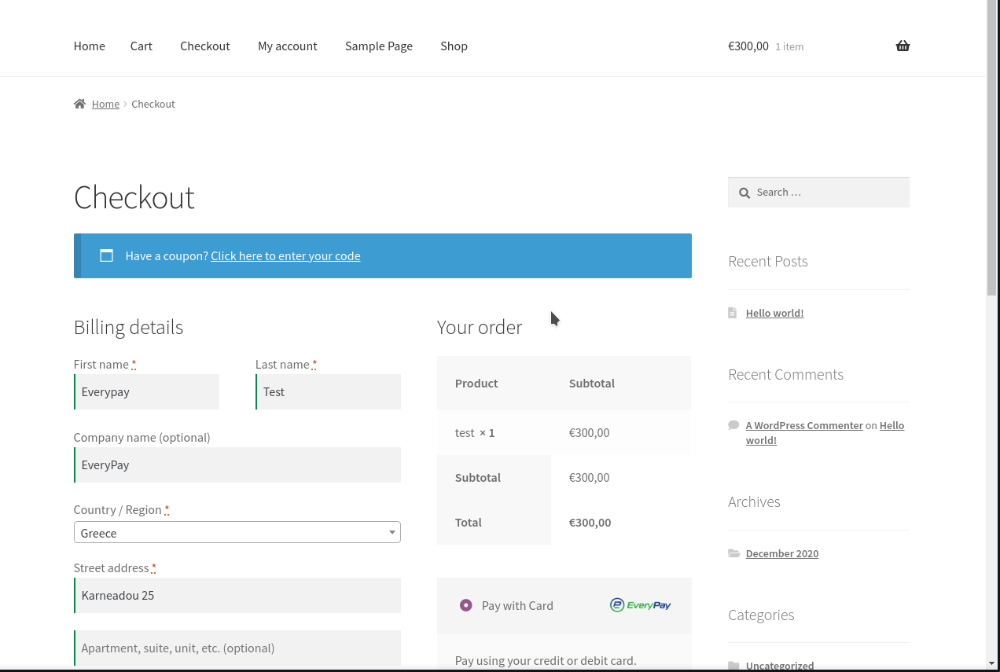

   

<h1 align="center">EveryPay Payment Gateway for WooCommerce</h1>
<h3 align="center">Accept Credit Cards and Debit Cards easily on your WooCommerce store using EveryPay.</h3>

  

## Description

EveryPay Payment Gateway is a plugin that extends WooCommerce and adds **EveryPay** as the payment method for accepting credit/debit cards payments.

### Requirements
* WordPress
* WooCommerce

### Features
1. Very Simple Clean Code plugin to add a Everypay payment method to woocommerce
2. No technical skills needed.
3. This plugin bundles with <a href="https://github.com/everypay/everypay-php">Official Everypay® API Libraries</a> Version 1.18.0 to support PHP 5.2 Compatibility.
4. Configurable through the woocommerce checkout admin panel
5. Tokenization

### Manual Installation
Upload 'everypay-woocommerce-addon' folder to the '/wp-content/plugins/' directory.

### Getting Started

1. Activate Everypay Payment Gateway in your WordPress plugin section.
2. Set your EveryPay public and secret key in WooCommerce -> Settings -> Payments -> Everypay Payment Gateway

### Frequently Asked Questions

1. You need to have WooCommerce plugin installed to make this plugin work
2. You need to obtain API keys from Everypay <a href="https://dashboard.everypay.gr/">Dashboard</a>
3. This plugin works on test & live api keys.
4. This plugin requires SSL for production mode, but can work without SSL for the sandbox environment.
5. This plugin comes packed with Official Everypay Libraries
6. This plugin requires CURL
7. Everypay & PCI compliance requires to use SSL always
8. This plugin Support refunds **(Only in Cents)** in woocommerce interface. On full refund order state changes automatically to refunded(WooCommerce Feature).
9. Upon refunds the items are not restocked automatically
### Translation

Due to incompatibility between the latest version of woocommerce and polylang you can use https://el.wordpress.org/plugins/theme-translation-for-polylang/ in order to translate this plugin.
